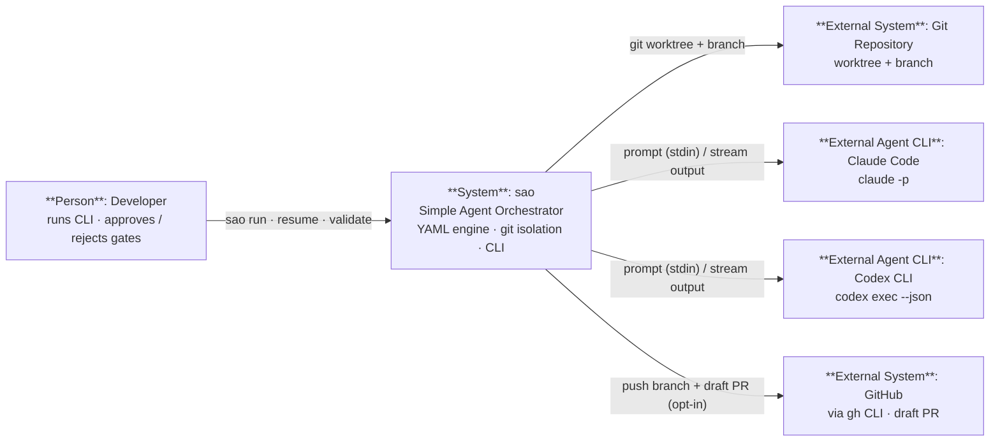

# C1 — System Context

> Level 1 of the C4 model. The **sao** system and its place in the world: a developer
> describes AI-agent pipelines as YAML, and sao runs them in an isolated git worktree,
> delegating the actual AI work to installed agent CLIs. No web UI, no database, no
> plugins — one binary, one YAML file, one branch per run.

Diagram source: [`C1-Context.excalidraw`](./C1-Context.excalidraw) (import in [excalidraw.com](https://excalidraw.com)). Raw elements: [`C1-Context.json`](./C1-Context.json).

## Diagram

## Elements

| Element | Type | Notes |
| --- | --- | --- |
| Developer | Person | Runs `sao run/resume/validate/...`; answers approval gates in the terminal. |
| **sao** | System | The Simple Agent Orchestrator — this repository. |
| Git Repository | External System | Source of truth; sao cuts a worktree + branch per run from `--base`/`base:`/HEAD. |
| Claude Code CLI | External Agent CLI | `claude -p`; prompts piped over stdin, output streamed back. |
| Codex CLI | External Agent CLI | `codex exec --json`; non-interactive, `workspace-write` sandbox. |
| GitHub (via gh CLI) | External System (opt-in) | `--auto-open-pr` pushes the run branch and opens a draft PR. |

## Key relationships

- Developer → sao: `sao run <workflow.yaml> [task]`, `resume`, `validate`, and y/n + feedback at gates.
- sao → Git: creates `.sao/worktrees/<id>` on branch `sao/<id>`, finalizes with a commit on success.
- sao → Claude/Codex: prompts and streams output; config (model, MCP, tools) is forwarded, not hosted.
- sao → GitHub: optional push + `gh pr create --draft`; failures degrade to a manual PR hint.
