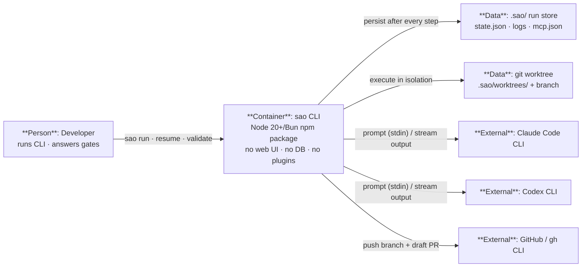

# C2 — Containers

> Level 2 of the C4 model. Zoom into **sao**: the whole system is a single deployable
> container (a Node 20+/Bun CLI published to npm as `simple-agent-orchestrator`). Its
> only "storage" is plain files on the local filesystem — there is no database.

Diagram source: [`C2-Containers.excalidraw`](./C2-Containers.excalidraw) (import in [excalidraw.com](https://excalidraw.com)). Raw elements: [`C2-Containers.json`](./C2-Containers.json).

## Diagram

## Containers

| Container | Type | Technology | Responsibilities |
| --- | --- | --- | --- |
| **sao CLI** | Application (CLI) | Node 20+/Bun, `commander`, `yaml`, `zod`, `picocolors` | Parses workflows, schedules nodes, streams output, prompts at gates, persists state, manages worktrees/branches/PRs. |

## Data stores

| Data store | Type | Details |
| --- | --- | --- |
| `.sao/` run store | JSON files on local disk | `.sao/runs/<id>/state.json`, `logs/<node-id>.log`, `mcp.json`; written atomically after every step. |
| git worktree | git checkout | `.sao/worktrees/<id>` on branch `sao/<id>`, cut from the base ref; kept until `sao clean`. |

## External software systems

| System | Purpose |
| --- | --- |
| Claude Code CLI | Default agent runner (`claude -p`). |
| Codex CLI | Second agent runner (`codex exec --json`). |
| GitHub / gh CLI | Optional draft-PR finalization (`--auto-open-pr`). |
