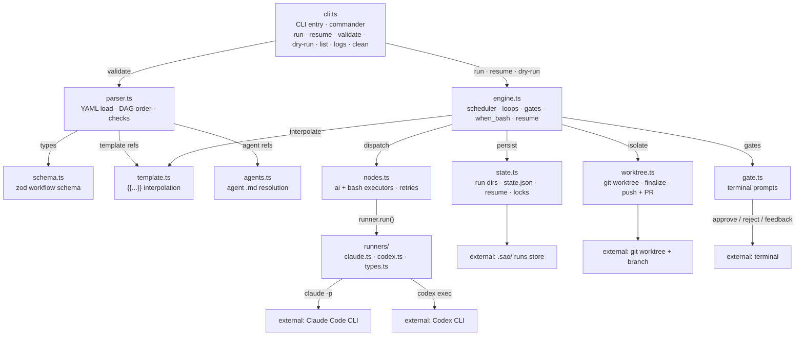

# C3 — Components

> Level 3 of the C4 model. Zoom into the **sao CLI** container: each component is one
> `src/` module. The runner adapters are the pluggable seam — a new agent CLI is one
> new file in `src/runners/` implementing the `Runner` interface.

Diagram source: [`C3-Components.excalidraw`](./C3-Components.excalidraw) (import in [excalidraw.com](https://excalidraw.com)). Raw elements: [`C3-Components.json`](./C3-Components.json).

## Diagram

## Components

| Component | Source | Responsibilities |
| --- | --- | --- |
| `cli.ts` | `src/cli.ts` | Commander-based command wiring: `run`, `resume`, `validate`, `list`, `logs`, `clean`; flag parsing; error formatting. |
| `schema.ts` | `src/schema.ts` | Zod schemas for `ai`/`bash`/`loop`/`gate` nodes, inputs, defaults, and the workflow document. |
| `parser.ts` | `src/parser.ts` | `loadWorkflow()` (YAML → validated `Workflow`), `orderNodes()` (topological DAG order + cycle check), template-reference and runner checks. |
| `template.ts` | `src/template.ts` | Mustache-style `{{...}}` interpolation: `{{task}}`, ``, `{{nodes.<id>.output}}`, `{{loop.*}}`, `{{base}}/{{branch}}/{{run_id}}`. |
| `agents.ts` | `src/agents.ts` | Resolves `agent:` references to `.agents/agents/<name>.md`; parses frontmatter into model/permissions/system prompt. |
| `engine.ts` | `src/engine.ts` | `runWorkflow()` orchestration + `Engine` scheduler: dependency ordering, concurrency, loops (sentinel / `until_bash` / steps), gates, `when_bash`, resume seeding. |
| `nodes.ts` | `src/nodes.ts` | Executors: `executeAiNode()` (calls a runner), `executeBashScript()`/`evaluateWhenBash()` (via `runShell`), `withRetries()`. |
| `gate.ts` | `src/gate.ts` | Terminal prompts (`promptOnTerminal`), reply parsing for gates and strict interactive-loop verdicts. |
| `state.ts` | `src/state.ts` | Run dir layout, `state.json` persistence, run locks, `loadRun`/`listRuns`, repo-root discovery. |
| `worktree.ts` | `src/worktree.ts` | Git worktree lifecycle (`addWorktree`), finalize commit, branch validation, push + `gh pr create --draft`. |
| `runners/` | `src/runners/*.ts` | `Runner` interface + registry; `claude.ts` (`claude -p`), `codex.ts` (`codex exec --json`). |

## Key relationships

- `cli.ts` validates via the parser and drives the engine for `run`/`resume`/`--dry-run`.
- `engine.ts` dispatches node execution to `nodes.ts`, interpolates prompts via `template.ts`, prompts humans via `gate.ts`, persists via `state.ts`, and isolates via `worktree.ts`.
- `nodes.ts` calls whichever `Runner` the resolved config selects; runners spawn the external agent CLIs.
