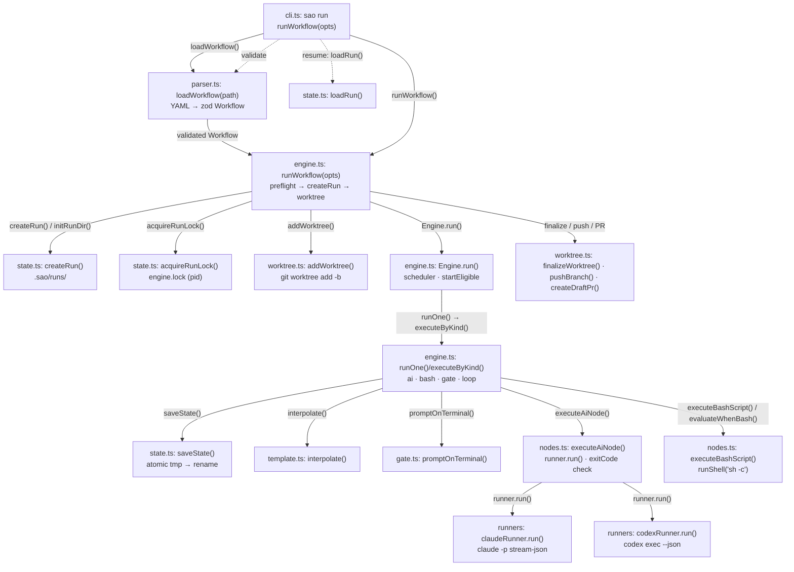

# C4 — Code

> Level 4 of the C4 model. Function-level detail of the `sao run` path: each box is an
> exported function or class member from `src/`, grouped by module. Solid arrows are the
> main run path; dashed arrows are support calls (interpolation, gates) and the resume /
> validate paths.

Diagram source: [`C4-Code.excalidraw`](./C4-Code.excalidraw) (import in [excalidraw.com](https://excalidraw.com)). Raw elements: [`C4-Code.json`](./C4-Code.json).

## Diagram

## Modules and key functions

| Module | Key functions | Notes |
| --- | --- | --- |
| `cli.ts` | `sao run` / `resume` / `validate` / `list` / `logs` / `clean` actions | Commander wiring; `findRepoRoot()` anchors `.sao/`. |
| `parser.ts` | `loadWorkflow()`, `orderNodes()` | YAML → validated `Workflow`; topological order + cycle check. |
| `schema.ts` | zod `aiNode`/`bashNode`/`loopNode`/`gateNode`/`workflowTop` | Node and workflow shapes. |
| `template.ts` | `interpolate()`, `collectRefs()`, `isLoopRef()` | `{{...}}` substitution and reference validation. |
| `engine.ts` | `runWorkflow()`, `Engine.run()`, `runOne()`, `executeByKind()`, `executeLoop()` | Scheduler, loops, gates, resume seeding. |
| `nodes.ts` | `executeAiNode()`, `executeBashScript()`, `evaluateWhenBash()`, `runShell()`, `withRetries()` | Executors over `Runner` and `sh -c`. |
| `gate.ts` | `promptOnTerminal()`, `parseGateReply()`, `parseLoopReply()` | Terminal y/n + feedback; strict loop verdicts. |
| `state.ts` | `createRun()`, `saveState()`, `loadRun()`, `acquireRunLock()`, `listRuns()`, `findRepoRoot()` | Run persistence, locking, resume. |
| `worktree.ts` | `addWorktree()`, `finalizeWorktree()`, `pushBranch()`, `createDraftPr()`, branch validation | Git isolation and opt-in PR finalization. |
| `runners/` | `Runner` interface, `getRunner()`, `claudeRunner`, `codexRunner` | Pluggable agent-CLI adapters. |

## Main run path (solid)

1. `cli.ts` `sao run` → `parser.ts:loadWorkflow()` then `engine.ts:runWorkflow()`.
2. `runWorkflow()` preflights AI configs (`getRunner()`), creates the run dir (`state.ts:createRun()`), acquires the lock (`state.ts:acquireRunLock()`), and adds the git worktree (`worktree.ts:addWorktree()`).
3. `Engine.run()` schedules eligible nodes; `runOne()` → `executeByKind()` dispatches by node kind.
4. AI nodes → `nodes.ts:executeAiNode()` → `runner.run()` (claude/codex adapter); bash nodes → `executeBashScript()` via `runShell('sh -c')`.
5. State is saved after every node/iteration (`state.ts:saveState()`); on success the worktree is finalized and, with `--auto-open-pr`, pushed with a draft PR.

## Support / resume paths (dashed)

- `engine` → `template.ts:interpolate()` — every prompt/script is interpolated before execution.
- `engine` → `gate.ts:promptOnTerminal()` — gates and interactive loops pause for the human.
- `cli.ts` `sao resume` → `state.ts:loadRun()` → `runWorkflow({ resume })` — resumes from the failed node/iteration with the persisted configuration hash checked.
- `cli.ts` `sao validate` → `loadWorkflow()` + `preflightAiConfigs()` — the same checks a real run performs before its first side effect.
