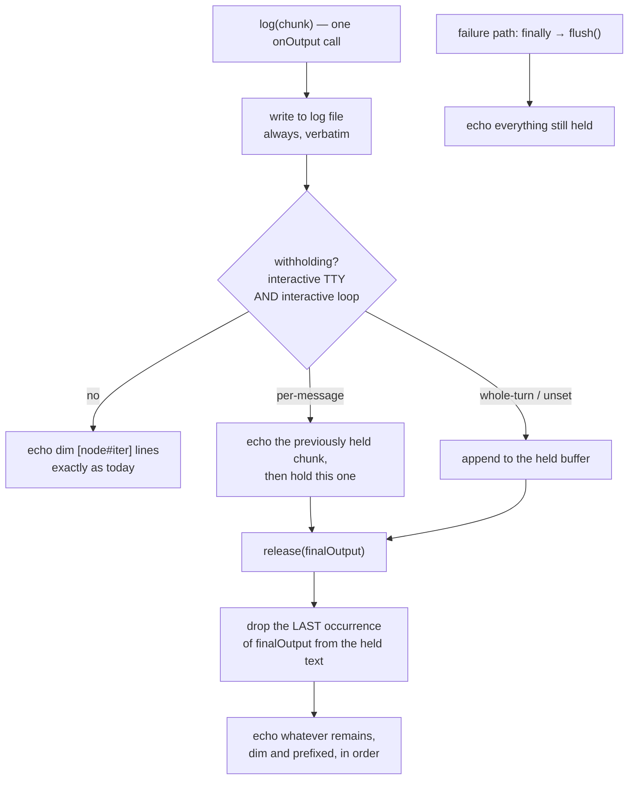

Decision D2. The human lifted the story's "no runner change" guarantee at the approval
gate to buy live narration — `user-story.md` Notes records the call. The log file is
untouched: `log()` still writes every chunk verbatim and immediately; only the **echo**
is withheld.

- `finalOutputStreaming?: "per-message" | "whole-turn"` on `Runner`. `claudeRunner` and
  `codexRunner` declare `per-message` — each agent message reaches `onOutput` as one
  call (`claude.ts:101`, `codex.ts:120`) and `result.output` is the final one.
  `opencodeRunner` declares `whole-turn` — ACP accumulates every `agent_message_chunk`
  into `output` (`acp.ts:222`), so no agent text can be shown live without duplicating
  it. **Unset means `whole-turn`**: mock runners, embedders and future adapters get the
  conservative branch for free, so adding a runner stays one file plus a registry entry.
- The field is a **liveness hint, not a contract**. Correctness in both branches comes
  from the same string match at release, so a wrong or missing declaration degrades to
  "shown twice", never to "shown zero times".
- Withhold only when `isInteractive()` (exported by task-2) **and** the log belongs to
  an interactive loop iteration. Every other node and every piped run keeps today's
  echo, chunk by chunk.
- `per-message`: hold the most recent `onOutput` chunk; when the next one arrives, echo
  the held chunk as ordinary dim prefixed lines. Narration therefore scrolls live,
  lagging by one message — the final narration message lands when the agent's final
  message arrives, which is the pause. Known cost: a runner that writes to stderr
  *after* its final message flushes that message into the echo, so it shows twice —
  today's behaviour, not a regression.
- `whole-turn`: hold every chunk of the iteration and release at the pause.
- `release(finalOutput)` removes the **last** occurrence of the final output from the
  held text and echoes the remainder in order. Last, not first: an agent that says the
  same thing twice keeps its earlier copy on screen rather than losing it to the box.
- Matching is on the held text with trailing whitespace per line ignored, since the echo
  path already drops blank lines.
- The remainder is what keeps interleaved stderr and the "could not read the agent's
  declared options" warning (`engine.ts:1041`) on screen.
- Call `release` **inside** the iteration's `try`, after options parsing and before
  `until_bash` — `flush()` runs in the `finally` at `engine.ts:1052`, before the pause,
  so a release placed after it would come too late.
- `flush()` keeps echoing whatever is still held, which is what makes a timeout, crash
  or rejection release rather than swallow.
- Line assembly is unchanged: partial lines still buffer, and the 8192-char runaway
  guard (`engine.ts:1213`) still applies to the released text.

`SPEC.md` update in this slice: the **Runner interface** section gains
`finalOutputStreaming` with its default and the one-line reason, and the
interactive-loop section notes that at a TTY an iteration's echo is released at the
pause with the final message removed.

Testing: engine tests inject a mock `Runner`, so a test controls both the declaration
and the exact `onOutput` call pattern — one mock declaring `per-message` and calling
once per message, one declaring `whole-turn` and calling per chunk, one leaving the
field unset. Assert on the captured `print` lines, not on real stdout. The adapter
declarations are asserted directly on the exported runner objects.
