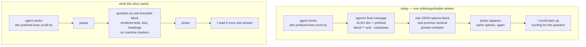

# A readable question when a run pauses to ask me something

**As a** developer running sao
**I want** the agent's question to arrive as one readable, findable block instead of dim prefixed lines with sao's own machine markers left in
**so that** I can see what I'm being asked and answer it, without hunting up the scroll and mentally stripping asterisks and JSON

## Context

Interactive loops are conversations — an agent interviews me one question per
iteration. But the question is the one piece of text in a run I have to *read and
act on*, and it is currently displayed exactly like the progress trace I skim past:
dim, prefixed with `[<node>#<iteration>]` on every line, markdown syntax intact.
On top of that, sao asks the agent to emit two machine markers, consumes both, then
also shows me the wire format — `<options>[{"id":…}]</options>` appears as raw JSON
right beside the picker rendered from it, and `<promise>SIGNAL</promise>` appears
even though the pause line already says `agent signaled X` / `no signal yet`.

Surface: **CLI terminal output only** — what sao prints at a pause. No YAML schema
change, no change to what is asked of the agent. The "no runner change" clause
originally here was **lifted by the human at the approval gate** — see the last Note
below.

Scope, settled during the interview: this covers the **pause moment** only (an
interactive loop iteration, and a gate). The ongoing streamed echo of tool activity
stays dim and prefixed as it is today — the `[<node>#<iteration>]` prefix is what
attributes lines when independent nodes run concurrently, and that must not change.

The two markers are the same defect seen twice, so both go. Because the pause
already serializes on one terminal queue, dropping the per-line prefix inside the
question block costs no attribution.

**Locked-decision collision, surfaced and decided.** `SPEC.md:225` locks *"Piped
replies are a separate channel with no menu at all"*, and `SPEC.md:234-238`
documents typing an option's `id` verbatim as that channel's way to pick one. The
raw `<options>` JSON in the echo is currently the only place those ids are visible,
so stripping it on the piped path would remove the affordance `SPEC.md` documents.
**The human's call: apply all of this only at an interactive terminal.** With no
TTY, output is byte-for-byte what it is today, markers included. This keeps the
locked decision untouched and keeps ANSI escapes out of captured CI output.

## Acceptance criteria

- At an interactive terminal, when an interactive loop iteration pauses, the agent's
  final message is displayed once as a single visually bounded block: markdown
  emphasis, lists and headings render as formatting rather than as literal `**`,
  `-` and `#` characters, and no `[<node>#<iteration>]` prefix appears on its lines.
- The block is findable after a long run: a boundary marks where the agent's message
  starts and where it ends, distinguishable from the dim streamed lines above it.
- No `<options>…</options>` block and no `<promise>SIGNAL</promise>` token appears
  anywhere in the terminal at the pause; the picker still offers exactly the agent's
  declared options in the order it sent them, and the pause line still reports
  `agent signaled X` / `no signal yet`.
- The final message appears **once**: it is not also echoed line-by-line as it
  streams. The same text is not on screen twice.
- With no interactive terminal (piped replies, stdin closed, CI), terminal output is
  unchanged from today — raw markers included, dim prefix included, no ANSI
  formatting introduced — so replying with an option's `id` still works exactly as
  `SPEC.md:234-238` documents.
- `.sao/runs/<id>/logs/*.log` still contains the agent's raw output verbatim,
  markers and markdown syntax intact, with no formatting escapes injected.
- Must not regress: the streamed echo of non-final agent output keeps its dim
  `[<node>#<iteration>]` prefix, so concurrent nodes remain attributable.
- Must not regress: an unparseable `<options>` declaration still falls back to the
  run's own entries with a warning on the iteration's log (SPEC.md:220-223); an
  agent message that is empty, or that is nothing but a marker, still reaches a
  usable pause rather than printing an empty or broken block.
- Must not regress: a resumed run (`sao resume`) that pauses at an interactive loop
  displays the question the same way a first run does.
- Must not regress: gate nodes, permission prompts and the interactive-loop picker
  keep their current behaviour and reply vocabulary; Ctrl-C at a pause still exits
  via the existing SIGINT path.

## Notes

Decisions the human already made — do not re-ask:

- Scope is the pause moment only, not the whole echoed stream.
- Rendered markdown **plus** a visible boundary, not merely plain-and-spaced text.
  The human accepted the consequence that sao now interprets agent text rather than
  passing it through.
- Both markers are stripped from the pause display (`<options>` and the `<promise>`
  sentinel), not just the reported `<options>` case.
- Interactive terminal only. Piped/non-TTY behaviour is deliberately left alone,
  explicitly to avoid amending the locked "no menu at all" decision.
- The final message appears once, replacing its streamed dim echo. The human
  accepted the trade: no more watching the answer type itself out live.
- Logs stay verbatim; the log is the debugging record and must not become lossy.
- **"No runner change" is lifted — decided at the approval gate.** Printing the final
  message once means withholding its streamed echo, and doing that with no runner
  input costs liveness: an iteration's narration would arrive in one burst at the
  pause. The collision was put to the human with both options; **their call: take the
  `Runner` change.** A runner now declares its streaming granularity, so narration
  keeps scrolling live. This amends `SPEC.md`'s Runner interface section, knowingly.

Motivating case: this repo's own `workflows/sao-features-orchestrator/` dogfooding
run — the paste in `requests.md` is a real `grill-user-story` iteration.

Relevant existing behaviour for `spec_partner`: `src/engine.ts:1204` (the dim
prefixed echo), `src/engine.ts:1140-1194` (`askLoopGate`, which builds the pause
message and choices), `src/options.ts` (marker parsing and the instruction text),
`src/gate.ts:181-221` (`runListPrompt` and the TTY-vs-piped seam).
