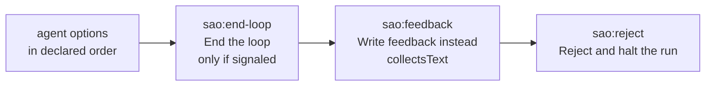

Wire `src/options.ts` into `executeLoop` / `executeSteps` / `askLoopGate`
(`src/engine.ts:945`, `:1038`, `:1091`).

- Append `AGENT_OPTIONS_INSTRUCTION` wherever `sentinelInstruction()` is appended
  **only when `body.interactive`** — single-prompt loops (`:978`) and the last AI
  step of a `steps:` loop (`:1075`) (`@s-loop-instruction-appended`).
- Parse `instructedOutput` — the same string the sentinel is matched in (`:1013`),
  so a stale option list from an earlier iteration can never be presented.
- `askLoopGate` builds choices in this order (`@s-loop-options-listed`):

- `{ kind: "choice" }`: an agent option → `{ kind: "feedback", text: option.label }`
  (`@s-loop-option-feeds-label`); `sao:end-loop` → `{ kind: "approve" }`;
  `sao:reject` → `GateRejectedError` (`@s-loop-reject-entry`).
- `{ kind: "text", from: "sao:feedback" }` → `{ kind: "feedback", text }`
  verbatim. `parseLoopReply` is **not** called on it: the human picked `Write
  feedback instead`, so `approve` is what they wrote, not a verdict
  (`@s-loop-feedback-entry`, `@s-loop-feedback-keeps-verdict-words`). An empty
  answer re-asks the same iteration. Untagged `{ kind: "text" }` is the piped
  line, and that is task 6's precedence.
- The letter prompt at `:1098` is **deleted** — the second and last of the two old
  renderings, so `@s-old-renderings-gone` is asserted here: neither
  `[a]pprove / [r]eject / or type feedback` (gate, task 2; loop, this task) nor
  `  1. Allow` (permission, task 3) survives anywhere in `src/`.
- `sao:end-loop` is omitted on an unsignaled iteration, which removes the
  "has not emitted … yet" warning **from the terminal path only** — it stays for
  piped replies (task 6) (`@s-loop-end-entry-only-when-signaled`).
- `parseAgentOptions` returning `undefined` → controls only. When a block was
  present but unreadable, print a warning naming the node to the iteration log
  and carry on (`@s-loop-no-options-fallback`, `@s-loop-malformed-fallback`).
- Resume is unchanged and needs no `state.json` field: the loop resume hint
  re-runs the interrupted iteration, so the agent re-declares its options.

**Docs:** `SPEC.md` § *Loop semantics* — how an agent declares options, that they
reach every runner because the channel is the agent's own output, the list
composition, the malformed fallback, and that the chosen `label` becomes
`{{loop.feedback}}`. `README.md`: document the declaration next to the loop
example (line 148) and the `interactive: true` comment (line 154).
