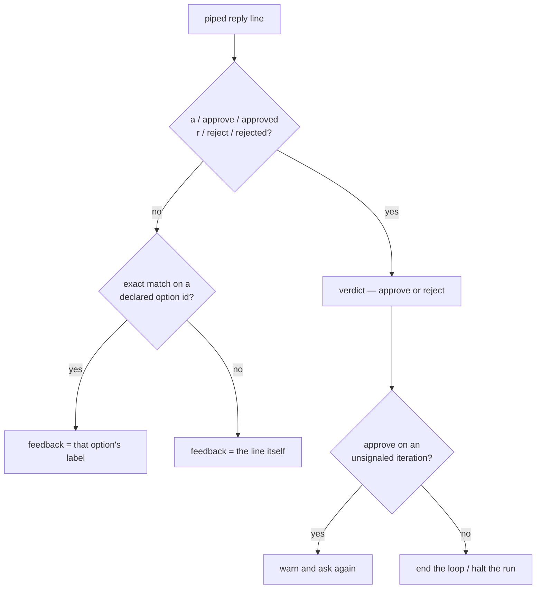

Close the non-TTY path for agent-declared options: `parseLoopReply` takes the
iteration's options and resolves a line in this fixed precedence. This path sees
only untagged `{ kind: "text" }` answers — a `from`-tagged one came from a list
selection and never reaches here (task 1).

- Verdict words win over an identical option id, so an agent declaring an option
  with id `a` cannot cost the human the loop's exit path
  (`@s-loop-piped-verdict-precedence`).
- Matching is exact on `id` — no index, because no menu is printed for a number
  to refer to, and an index would shift as the agent reorders its list.
- An empty line still re-asks; a non-matching line is feedback, exactly as today
  (`@s-loop-piped-freeform-is-feedback`).

**Docs:** `SPEC.md` § *Loop semantics* — the typed-line path names an option by
its `id`, verdict words take precedence, and no menu is rendered on that path.
`README.md`: beside the declaration docs task 5 adds to the loop example, state
how a piped reply picks a declared option — one line, the option's exact `id` —
and that a verdict word wins a collision. A workflow author scripting replies
into a loop needs this at README level, not only in `SPEC.md`.
