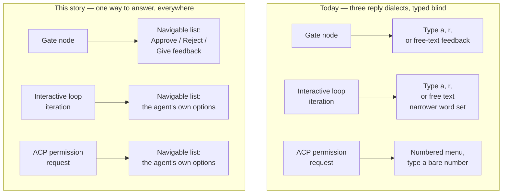
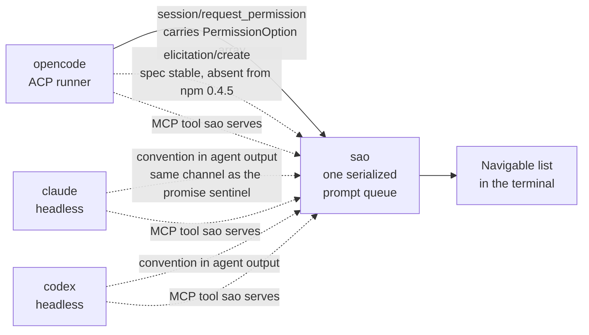
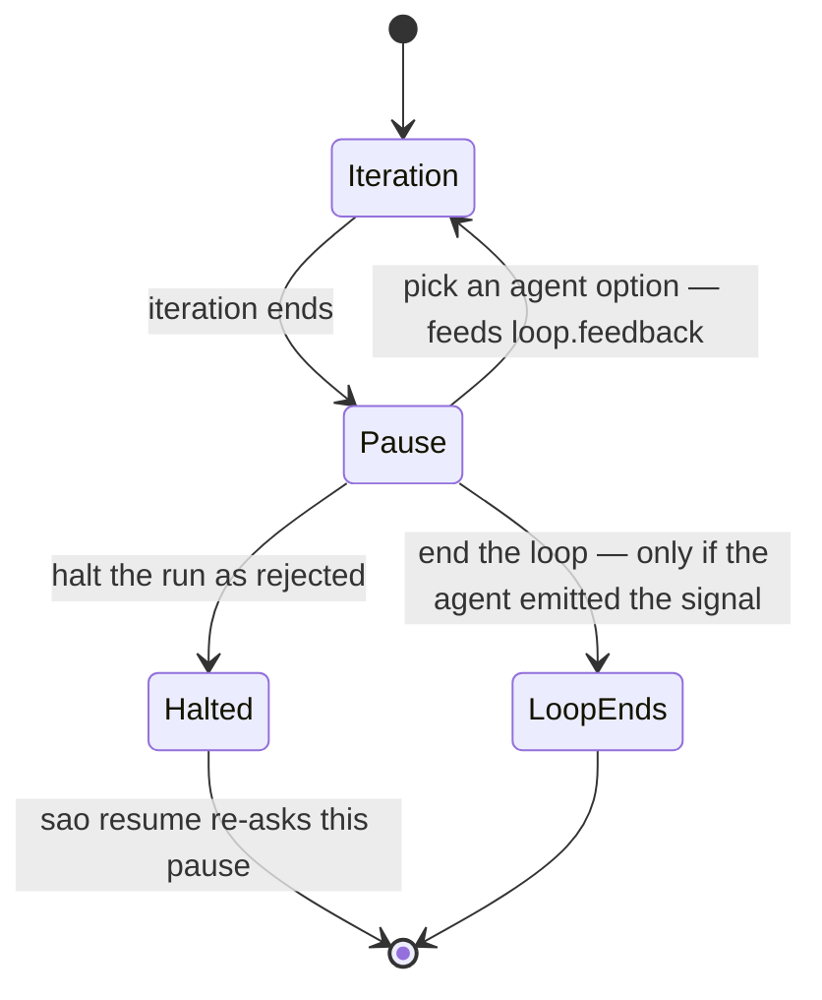
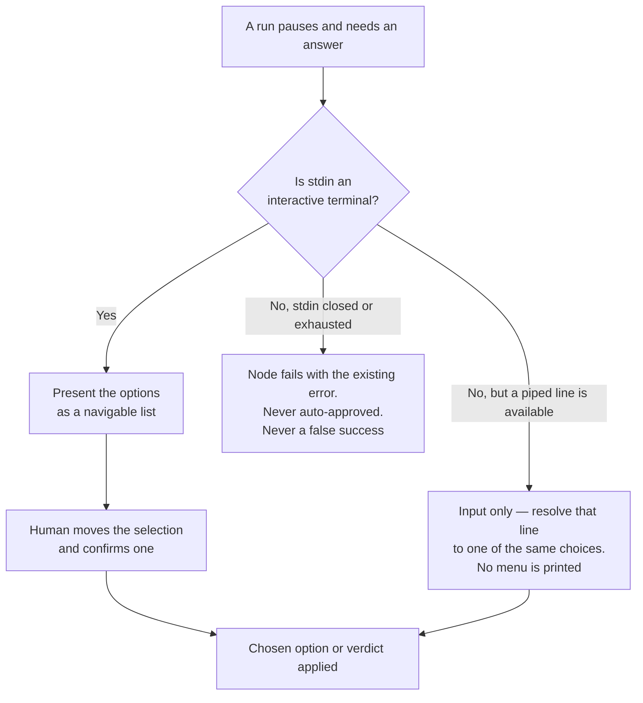

# Answer a paused run by picking from a list, including the options the agent itself is asking about

**As a** developer running `sao`
**I want** every pause in a run to show me the answers that actually apply to it —
the agent's own options when an agent is the one asking — as a list I move through
and pick from **so that** I answer the question in front of me by choosing from it, 
instead of recalling which letter or number means what and typing it blind into 
a prompt whose choices were fixed before the agent ever spoke.

## Context

A run pauses in three places, and each one asks for a typed reply against a
vocabulary the human has to know in advance:

- Gate nodes print `[a]pprove / [r]eject / or type feedback`.
- Interactive-loop iterations print the same three, but accept a narrower set of
  words: a plain gate treats `y`/`yes`/`n`/`no` as verdicts, an interactive loop
  deliberately does not, because there "yes" is an answer to the agent's question and
  must flow through as feedback.
- An ACP runner's permission request renders the agent's own options as a numbered
  menu and accepts only a bare number, re-asking on anything else.

So three pauses sharing one terminal queue speak three reply dialects, none of it
visible at the moment of answering. Worse, two of those pauses are an agent asking
the human something, yet the offered answers are fixed at approve / reject / feedback
regardless of what was asked. When an agent's real question is "Postgres or SQLite?",
the human is offered three words that answer a different question, and has to type
the actual answer as free-form feedback.

**The presentation rule is absolute: wherever a run offers the human a set of options,
that set is a navigable list.** No exceptions, no pause type left behind, no
circumstance in which a human is shown `[a]pprove / [r]eject / or type feedback` 
or a numbered `1. Allow / 2. Deny` menu again. Those renderings are removed, not
supplemented — this story is not satisfied by adding a list next to them or by reaching
a list only along a preferred path. If a human is looking at options, they are moving
through a list.

**What is in the list, per pause type** — the human's call, recorded here. This governs
*which options appear*, never whether they appear as a list:

- **Gate nodes keep the fixed verdicts.** A gate is authored by a human in the
  workflow YAML and has no agent behind it, so there is nobody to author options; its
  approve / reject / feedback are the point — now as list entries rather than letters.
- **Interactive-loop iterations and ACP permission requests present the agent's own
  options.** These are the pauses where an agent is asking, so the list is whatever
  it asked.

**This must work on all three runners**, uniformly, so a workflow author gets one
behavior regardless of `runner:`. The channels differ sharply, and this is the crux
of the work:

- **opencode (ACP)** already carries agent-authored options today:
  `session/request_permission` delivers `PermissionOption[]`, sao renders them and
  returns the chosen `optionId` verbatim. Only the presentation is missing.
- **claude and codex** are headless. They have no protocol channel for a question in
  what sao reads today — only the agent's own output, the same channel sao already
  string-matches for `<promise>NAME</promise>`.

**Uniform behavior across the three runners is the locked requirement; the transport
that delivers it is not.** With the non-goals set aside there is more than one way to
close the gap, and choosing among them is `spec_partner`'s — this story states what the
human must get, never which channel carries it. The avenues, with what each costs, are
recorded under **Notes**: a convention carried in agent output, ACP
`session/request_permission`, ACP's newer `elicitation/create`, and sao serving an MCP
tool the agent calls, which is the one avenue reaching all three runners over a single
protocol. Nothing here elects one, and no avenue is excluded for appearing in the old
non-goals list.

Solid arrows below already reach sao today; dashed arrows are avenues that need work.

Surfaces touched, coarsely: the CLI's terminal interaction and the internals behind
it (the shared prompt queue in `src/gate.ts`, the gate and interactive-loop pauses in
`src/engine.ts`, the permission prompt in `src/acp.ts`), plus whichever channel carries
an agent's options — which, depending on the avenue chosen, may add an MCP surface sao
serves rather than forwards. Distribution is touched too: the human wants
this to work on macOS, Linux, **and Windows**, and `package.json` currently declares
`"os": ["darwin", "linux"]`, so `sao` cannot be installed on Windows at all today.

**Collisions with `SPEC.md`, named so the calls are knowing:**

1. § *Gate semantics* locks the prompt as the literal `[a]pprove / [r]eject / or type
   feedback`, and § *Permission requests (ACP runners)* locks the rendering as "the
   agent's **own** options as a numbered menu (`1. Allow`, `2. Deny`, …)". Both
   renderings change.
2. § *Loops* locks the narrower verdict vocabulary for interactive loops as a
   deliberate decision, because those pauses are conversations. Picking from a list
   sidesteps the ambiguity that vocabulary exists to prevent — but only for a human at
   a real terminal, so the distinction must still hold wherever replies arrive as
   typed lines.
3. § *Loops* also locks the loop's exit and halt paths through those verdicts: "a bare
   approve ends the loop, but only on an iteration where the agent emitted the signal",
   and reject halts the run. An interactive-loop pause therefore cannot present *only*
   the agent's options — the human would lose the sole way to end a signaled loop or
   halt the run. How agent options and those two paths coexist in one list is design,
   left to `spec_partner`; that they must coexist follows from the locked semantics.
4. § *Decisions (locked)* fixes Distribution at `engines: node >= 20`; the chosen
   library needs `node >= 20.12`, tightening that floor.
5. § *Decisions (locked)* fixes Interface as "Pure CLI, live progress in terminal",
   and § *MCP* fixes sao as "Pass-through, not a host". Both may need amending
   depending on the mechanism chosen — see the ruling immediately below.

Collision 3 in picture form — the two paths that must stay reachable in an
interactive loop's list, whatever else the agent adds to it:

**The v1 non-goals do not constrain this requirement — the human's explicit ruling.**
`SPEC.md`'s § *Non-goals (v1, explicitly)* describes the boundary of the version that
shipped, not a veto over new scope, and this is new scope. Nothing in that list may be
cited as a reason to narrow the mechanism, and no avenue below is off the table because
it appears there. Where the chosen mechanism crosses that boundary, § *Non-goals* is
amended along with the rest of the document, in the same change.

What must not be disturbed is why these pauses are careful today: `SPEC.md` requires
that with no interactive terminal a paused node **fails** the way a gate does and is
never auto-approved, and that replies may arrive piped one line per prompt. The suite
exercises exactly that, feeding replies to a spawned CLI over a pipe.

## Acceptance criteria

The three outcomes a pause must have, and the one that is easiest to get wrong — a
prompt nobody can answer must fail the node, never drain quietly and exit 0:

- **No human-facing prompt anywhere in a run renders a letter or number menu.** The
  strings `[a]pprove / [r]eject / or type feedback` and a numbered `1. Allow / 2. Deny`
  no longer appear in sao's output at all — not at a first ask, not at a re-ask after an
  unusable reply, not on any runner, not for any pause type. A search of the source for
  those renderings comes back empty.
- At an interactive terminal, a gate node presents approve, reject and give-feedback
  as a navigable list; the human moves the selection and confirms one without typing a
  letter, and choosing give-feedback then collects the feedback text.
- At an interactive terminal, an ACP permission request presents the agent's own
  options as the list — one entry per option, in the order the agent sent them — and
  sends back the chosen option's `optionId` verbatim. Nothing is sent to the agent
  until a choice is made.
- At an interactive terminal, an interactive-loop iteration whose agent declared
  options presents those options, on every runner: `opencode`, `claude` and `codex`.
  A workflow author declares nothing runner-specific to get this.
- Choosing an agent-authored option in an interactive loop feeds that option through
  to the next iteration the way a typed reply does today, as `{{loop.feedback}}`.
- The loop's own exit and halt paths remain reachable at that same pause: the human
  can still end a signaled loop and still halt the run as `rejected`, and `sao resume`
  re-asks.
- An interactive-loop iteration whose agent declared **no** options still presents the
  loop's existing answers, so an agent that never opts in behaves exactly as it does
  today.
- A malformed or unparseable option declaration in agent output does not crash the run
  and does not silently swallow the iteration: the pause falls back to the loop's own
  answers — still as a navigable list — and the run continues to a human decision.
- An agent-authored list longer than the terminal can show remains fully reachable —
  every option can be selected.
- The typed-line path is **input only, and prints no menu.** With stdin not an
  interactive terminal there is no human to present options to, so replies arriving as
  piped lines still resolve to a choice — including choosing among agent-authored
  options — without any letter or number menu being written to output. Existing
  piped-reply usage keeps working; what disappears is the rendering, not the channel.
- With stdin closed or exhausted, a pause still fails the node with the existing error
  rather than hanging or exiting `0`. A run can never report success because a prompt
  went unanswered.
- Two concurrent branches still cannot interleave prompts: at most one pause owns the
  terminal at a time, each naming the node it belongs to, and a node's `timeout` still
  excludes time spent waiting on or queued behind a prompt.
- `sao` installs on Windows, and the list prompt is usable in a Windows terminal.
- `SPEC.md` is amended in the same change, so the binding document describes the
  shipped behavior. Every passage the collisions above name is updated: § *Gate
  semantics* states the pause as a navigable list rather than the literal
  `[a]pprove / [r]eject / or type feedback`; § *Permission requests (ACP runners)*
  states a navigable list rather than a numbered menu; § *Loops* states where
  agent-authored options apply and how they reach each runner; and the § *Decisions
  (locked)* Distribution row states the raised node floor. The typed-line path is
  described as an input channel that renders nothing, including that a pause with no
  interactive terminal still fails and is never auto-approved.
- Where the chosen mechanism crosses the old v1 boundary, `SPEC.md` § *Non-goals (v1,
  explicitly)* and the § *Decisions (locked)* MCP row are amended in the same change,
  so the document states the scope sao now has rather than the scope it used to have.
  A stale non-goal left in place would read as a prohibition on shipped behavior.
- `README.md` no longer instructs the reader to answer these pauses by typing a letter
  or a number at an interactive terminal, and documents how an agent declares options.
- No regression in the repo's verify gate: `format` → `lint` → `typecheck` → `test`
  all pass, and the mutation suite holds its score.

## Notes

Decisions the human has already made — do not re-ask:

- **Every presented option set is a navigable list — no exceptions.** The letter prompt
  and the numbered permission menu are deleted, not kept as an alternative rendering,
  a fallback, or a flag. This is not negotiable down to "a list on the happy path".
- **Options per pause type:** gate nodes keep the fixed verdicts; interactive loops and
  ACP permission requests present the agent's own options. This decides *what is in the
  list*, never whether it is a list.
- **All three runners, uniformly.** `opencode`, `claude` and `codex` all reach the same
  behavior, and a workflow author declares nothing runner-specific to get it. This locks
  the *requirement*, not the transport: **which channel carries an agent's options is
  `spec_partner`'s to choose**, from the avenues below. An earlier answer in the
  interview paired this requirement with a specific transport — ACP for opencode, a
  convention on the agent's output channel for the other two — but the later ruling that
  the v1 non-goals do not constrain this reopened that field, and picking a transport is
  solution design, which this story does not do. Treat the pairing as a leaning, not a
  constraint.
- **Library: `@clack/prompts`.** Chosen over `@inquirer/select` and over a hand-rolled
  `node:readline` implementation: it bundles to ~50 KB through `bun build --target
  node`, has four pure-JS dependencies and no native bindings, needs `node >= 20.12`,
  and ships both the list prompt and the follow-up text prompt the feedback answer
  needs. Its option list is supplied per call, so an agent-authored list needs nothing
  extra, and `maxItems` covers a list longer than the terminal.
- **Amending `SPEC.md` is in scope, not a follow-up.** The document is binding, so the
  change that alters these prompts is the change that updates it, in the same PR.
- **Windows packaging: yes.** Drop `"os": ["darwin", "linux"]` from `package.json`.
  Made knowing the rest of the CLI on Windows — git worktree handling, the agent CLIs
  sao spawns — is untested there; this story claims only the install and the prompt.

Richer TUI alternatives, measured. None is rejected on non-goal grounds — each entry is
what testing showed, so the trade is visible rather than foreclosed:

- **`@opentui/core` 0.5.2** — on Node 22 it throws `OpenTUI native FFI is not
  available for this runtime yet` even with dependencies installed, while the same code
  runs under Bun. Its Zig library is `dlopen`ed at runtime, so it cannot be inlined into
  the published `dist/cli.js` the way every current dependency is; 18 MB installed
  across 8 per-platform binary packages. Available only if the locked Toolchain
  decision ("code stays Node-compatible (no Bun-only APIs)") and Distribution
  (`npm i -g sao` / `npx sao`) are revisited — a call for the human, not something this
  story forecloses. Note it would not satisfy the stated cross-platform condition for
  anyone installing sao under Node.
- **`ink` 7.1.1 + `ink-select-input`** — runs on Node, so it is the viable rich option.
  Requires `node >= 22`, pulls React, yoga and 25 dependencies for 1.21 MB bundled, and
  does not bundle without externalizing `react-devtools-core`, after which the bundle
  fails to run unless that package also ships.
- Both render full-screen and want to own the viewport, while these pauses are inline
  interruptions in a scrolling live-progress log that must survive them. That is a
  design mismatch to weigh, not a prohibition.
- **`blessed`/`neo-blessed`/`reblessed`, `terminal-kit`** — widget toolkits for
  full-screen apps, stale maintenance.

Facts established by research, carried here so they are not rediscovered as surprises:

- The chosen library, and every comparable one, **hangs and exits `0`** when stdin is
  not a TTY — the exact false-success failure `src/gate.ts` is commented to prevent.
  A list prompt is therefore only reachable when stdin is an interactive terminal; the
  existing line reader remains the other path. This is why the criteria pin both.
- The library accepts injected input/output streams and was driven to a correct answer
  over an in-memory stream pair with no TTY, so the new prompt is testable in-process.
- `src/gate.ts` holds a process-lifetime readline interface with a `line` listener on
  stdin; a list prompt is a second consumer of the same stream. Reconciling the two is
  `spec_partner`'s to design.
- Left to `spec_partner`, and deliberately not decided here: **how a piped line names a
  choice** now that no menu is printed — whether today's words (`a`, `approve`, a bare
  number) still resolve for compatibility with the existing spawned-CLI tests, or
  whether they are replaced by something addressing the option list directly. The one
  constraint from above is that no answer to this may put a letter or number menu back
  on screen.
**Avenues for agent-authored options, with the non-goals set aside.** `spec_partner`
picks; these are the measured facts about each, not a ranking:

1. **A convention in the agent's own output.** Works on all three runners with no
   protocol at all, over the channel sao already string-matches for
   `<promise>NAME</promise>`. Costs: it is text an agent can get wrong, so malformed
   declarations need a defined fallback (a criterion above pins this).
2. **ACP `session/request_permission`.** Already carries `PermissionOption[]` and
   already reaches sao. Mapping questions onto permission options is the ecosystem's
   own interim pattern, documented as forward-compatible with ACP Elicitation. Costs:
   opencode only; and opencode currently **disables** its `question` tool in ACP mode,
   so questions are dropped before reaching a client — verify against the pinned
   opencode before relying on this end-to-end. ACP's own RFD also argues permission
   requests are security decisions and should stay distinct from clarifying questions.
3. **ACP `elicitation/create`.** The RFD is marked completed and stabilized in protocol
   artifacts as of 2026-07-22; choices are expressed as an `enum`, or as `oneOf` with
   `const`/`title` pairs for titled single-select. Costs: `@zed-industries/agent-client-protocol@0.4.5`
   is **still the latest published npm version** — the one this repo pins *and*
   patches — and it exposes exactly one human-facing method,
   `session/request_permission`. Honoring `elicitation/create` today means handling the
   raw JSON-RPC method rather than bumping a dependency. opencode only.
4. **sao serves an MCP tool the agent calls** (an "ask the human" tool). This is the
   only avenue that reaches **all three runners over one protocol**, since all three
   already speak MCP and sao already forwards `mcp:` config and `allowed_tools`
   allowlists to them. Costs: sao stops being purely a pass-through and starts serving
   an endpoint of its own, so the § *MCP* row and § *Non-goals* both need amending, and
   the tool has to be reachable by an agent whose `allowed_tools` allowlist is
   author-controlled.
5. **MCP elicitation as a client** — worth naming only to rule out a plausible
   misreading: `elicitation/create` in MCP travels **server → client**, and the runner,
   not sao, is the MCP client. It is a channel for an *MCP server* to ask the human, not
   for the *agent* to ask. Its schema is restricted to flat objects of primitives, with
   choices as `enum` plus `enumNames`, and responses are
   `accept`/`decline`/`cancel`. It would only apply if sao hosted the MCP servers and
   relayed, which serves a different requirement than this story's.
